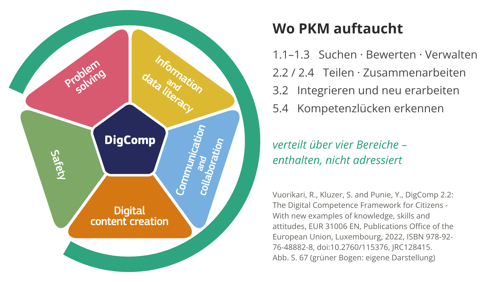
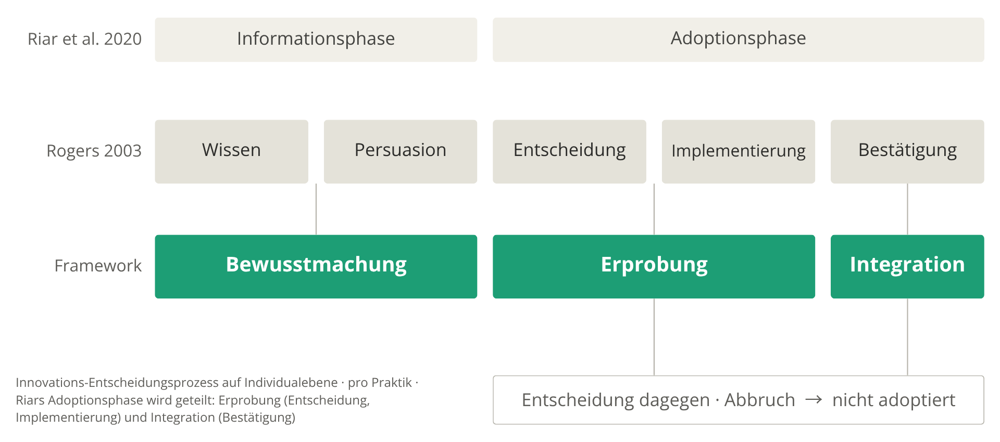
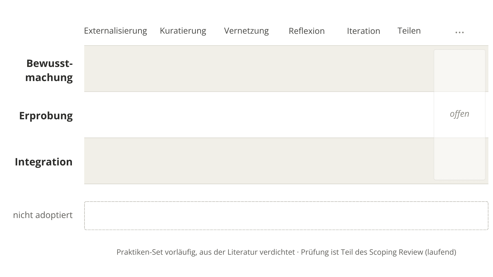
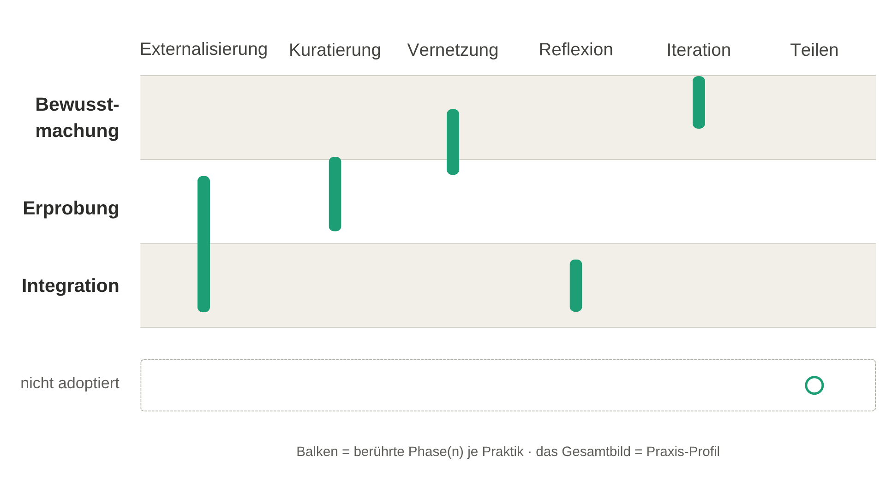

<!--
author:   Silvia
language: de
mode:     Textbook
comment:  PKM lernen – BWP-Sektionstagung 2026, Rostock. Folien minimalistisch
-->

# Persönliches Wissensmanagement lernen

<!-- style="font-size: 1.4em; font-weight: 300; color: #555; margin: 1.5em 0 2em" -->
Ein didaktisches Framework zur Förderung von Wissensmanagementkompetenzen im Hochschulkontext

**Silvia Retzlaff** · *Institut für Wirtschaftspädagogik* · Lehrstuhl für Wirtschaftsdidaktik mit dem Schwerpunkt digitales Lehren und Lernen in der beruflichen Bildung

---

## Persönliches Wissensmanagement als Forschungsgegenstand

(Baustein 1) Scoping Review: Mapping Personal Knowledge Management in Higher Education — Concepts, Models, and Tools · *Protokoll registriert via OSF*

(Baustein 2) Von der Lern-Story zum modulübergreifenden Wissensartefakt. Persönliches Wissensmanagement als Ansatzpunkt dialogischer Studiengangsentwicklung · *Poster dazu morgen in der Poster-Session*

(**Baustein 3**) **heute: Persönliches Wissensmanagement lernen - Didaktisches Framework**

---

## Die Person ist die Analyseeinheit

> Persönliches Wissensmanagement: individuelle Strategien, Methoden und Werkzeuge im Umgang mit dem eigenen Wissen

<!-- style="font-size: 0.85em; opacity: 0.7" -->
nach Siegel, Lohner & Arnold 2025 · Cheong & Tsui 2011

---

## PKM in Kompetenzmodellen

> Wo taucht der Umgang mit dem eigenen Wissen auf?

---

## Praktiken und Praxis
| **PKM-Praktiken** | **PKM-Praxis** |
|---|---|
| vermittelbar · benennbar | individuell zusammengesetzt · im Vollzug sichtbar |
| Externalisieren · Kuratieren · Vernetzen · Reflektieren · Iterieren · Teilen | die reflektierte Auswahl daraus |
| Repertoire → **Kompetenz** | Vollzug → **Performanz** |

<!-- style="font-size: 0.8em; opacity: 0.7" -->
Praktik/Praxis: Reckwitz 2003 · Kompetenz/Performanz: Klieme & Hartig 2007

---

## Was möchte ich erreichen?

<!-- style="font-size: 1.4em; font-weight: 300; color: #555; margin: 1.5em 0 2em" -->
> Studierende befähigen, sich aus einer informierten Position **für oder gegen PKM-Praktiken zu entscheiden** und die gewählten **zu einer individuellen PKM-Praxis entwickeln**.

<!-- style="font-size: 1.4em; font-weight: 300; color: #555; margin: 0 0 2em" -->
> **Lehrenden** didaktische Gestaltungsprinzipien an die Hand geben, um **Anlässe zu schaffen**, unter denen diese Entscheidung und Entwicklung **nicht beiläufig bleibt**.

---

## Wo stehe ich?

0. Selbstlernkurs (Offene Uni Rostock) · PKM-Praktiken · 2022/23
1. Pilot · eine Praktik (Vernetzung), eine Sitzung · SoSe 2026
2. Entwurf · Framework · heute vorgestellt
3. Planung · Erhebung WiSe 2026/27

---

# Das Framework

| |Entwicklungsfragen: |
|---|---|
| **deskriptiv** | Welche Praktiken gehören zu PKM? |
| **prozessual** | Wie werden Praktiken zur Praxis? |
| **didaktisch** | Wie lässt sich dieser Übergang gestalten? |

<!-- style="width: 55%; margin: 0.5em auto; display: block" -->

**Zwei Mechanismen**

- **Wissen** erweitert den Möglichkeitsraum – Praktiken *kennen*
- **Reflexion** wählt aus – Praktiken zur Praxis *individualisieren* · in action und on action (Schön 1983; van der Donk et al. 2022)

---

## Wie werden Praktiken zur Praxis?

<!-- style="font-size: 0.9em; opacity: 0.7" -->
Rogers' Innovations-Entscheidungsprozess, gelesen auf der Individualebene

<!-- style="font-size: 0.8em; opacity: 0.7" -->
Rogers 2003, S. 168 ff. · Zweiteilung nach Riar et al. 2020 (vgl. de Hart, Chetty & Archer 2015) · Dreiteilung: eigene Verdichtung

---

## Matrix · Perspektive Lernende

---

### Praxis = das Muster

[← zurück zu A, B und C](#8)

---

## Wie lässt sich der Übergang gestalten?

<!-- style="font-size: 0.9em; opacity: 0.7" -->
Möglichkeitsraum der Lehrenden: sichtbar machen · empfehlen · vormachen · Anlässe einbauen 

Beispiel Externalisierung – was Studentin A erlebt hat, als Anlass gedacht

| | |
|---|---|
| **Bewusstmachung** | Bisheriges Festhalten sichtbar machen lassen (Praxis-Inventar); Externalisierungsformen modellieren |
| **Erprobung** | Externalisierungsanlässe einbauen – Sitzungsnotiz mit Vorgabe und Freiraum |
| **Integration** | Rückblick auf eigene Notizbestände einplanen; Nicht-Festhalten als Entscheidung thematisieren |

---

### Gestaltungsprinzip

> *Wenn* Studierende Externalisieren in ihre Praxis integrieren sollen, *dann* plane Rückblicke auf ihre Notizbestände ein und thematisiere das Nicht-Festhalten als Entscheidung – *weil* erst die Wahl, was festgehalten wird und was nicht, aus dem Mitschreiben Teil der eigenen Praxis macht.

<!-- style="font-size: 0.8em; opacity: 0.7" -->
Wenn–dann–weil: van den Akker 1999 · Euler 2014

---

# Nächste Schritte

**A · Fragebogen** → Praxis-Profil

<!-- style="font-size: 0.85em; opacity: 0.8" -->
pro Praktik: Phase oder Nein · Ergebnis: das Muster (Performanz)

**B · Interview mit Visualisierung** → Profil-Fragen

<!-- style="font-size: 0.85em; opacity: 0.8" -->
das eigene Profil vor Augen: Wozu? Passt es? Bewusst oder unbewusst nicht adoptiert? · Ergebnis: die Entscheidungen dahinter (Kompetenz)

<!-- style="font-size: 0.85em; opacity: 0.7" -->
Wer: Studierende am Institut · ggf. darüber hinaus (offen) · Ziel: Gestaltungshypothesen empirisch informieren

---

# Diskussion

**A** · Ein DBR-Zyklus, im Rahmen eines Aufsatzes – Ergebnis: Gestaltungsprinzipien als Hypothesen. **Trägt diese Verortung, oder wäre ein explorativer Rahmen ehrlicher?**

**B** · Geplant: Fragebogen (Profil) + Interview mit dem eigenen Profil vor Augen. **Welche Methoden würden Sie wählen, um den Übergang von Praktik zu Praxis sichtbar zu machen?**

---

# Danke für die vielseitigen Impulse!

---

## Literatur
<!-- style="font-size: 0.75em; opacity: 0.8" -->
- Cheong, R. K. F. & Tsui, E. (2011). From skills and competencies to outcome-based collaborative work: Tracking a decade's development of Personal Knowledge Management (PKM) models. Knowledge and Process Management, 18(3), 175–193. https://doi.org/10.1002/kpm.380
- de Hart, K. L., Chetty, Y. B. & Archer, E. (2015). Uptake of OER by staff in distance education in South Africa. The International Review of Research in Open and Distributed Learning, 16(2), 18–45. https://doi.org/10.19173/irrodl.v16i2.2047
- Euler, D. (2014). Design Research – a paradigm under development. In D. Euler & P. F. E. Sloane (Hrsg.), Design-Based Research (ZBW Beiheft 27, S. 15–44). Franz Steiner.
- Klieme, E. & Hartig, J. (2007). Kompetenzkonzepte in den Sozialwissenschaften und im erziehungswissenschaftlichen Diskurs. Zeitschrift für Erziehungswissenschaft, Sonderheft 8, 11–29.
- Reckwitz, A. (2003). Grundelemente einer Theorie sozialer Praktiken. Eine sozialtheoretische Perspektive. Zeitschrift für Soziologie, 32(4), 282–301.
- Retzlaff, S. (2024). Dem Wissensfluss folgen. Erfahrungen aus der Entwicklung eines Onlinekurses zum persönlichen Wissensmanagement nach dem Zettelkastenprinzip für die Offene Uni Rostock. In: Wolff, T. B./ Retzlaff, S./ Rechenberger, J. H./ König, N. (Hrsg.): Quo Vadis? Tagung zur digitalen Lehre und Lehrkräftebildung in M-V. 2024, S. 64–69.
- Riar, M., Mandausch, M., Henning, P. A., D'Souza, T. G. & Voss, H.-P. (2020). Anreize und Hemmnisse für die Verwendung und Veröffentlichung von OER in der Hochschullehre: Eine Literaturanalyse und empirische Untersuchung. In A. Werner, T. Brinker, A. Spiekermann, M. Merkt & B. Stelzer (Hrsg.), Hochschuldidaktik als professionelle Verbindung von Forschung, Politik und Praxis (S. 109–123). wbv.
- Rogers, E. M. (2003). Diffusion of innovations (5. Aufl.). Free Press.
- Schön, D. A. (1983). The reflective practitioner: How professionals think in action. Basic Books.
- Siegel, S. T., Lohner, D. & Arnold, M. (2025). Reimagining teaching portfolios through Personal Knowledge Management with digital tools for thought. Zeitschrift für Hochschulentwicklung, 20(3), 231–258. https://doi.org/10.21240/zfhe/20-3/11
- van den Akker, J. (1999). Principles and methods of development research. In J. van den Akker, R. M. Branch, K. Gustafson, N. Nieveen & T. Plomp (Hrsg.), Design approaches and tools in education and training (S. 1–14). Kluwer.
- van der Donk, C., Klewin, G., Koch, B., van Lanen, B., Textor, A. & Zenke, C. T. (2022). „Reflection in and/or on action“: Schulische Praxisforschung als Reflexionsgeschehen. In C. Reintjes & I. Kunze (Hrsg.), Reflexion und Reflexivität in Unterricht, Schule und Lehrer:innenbildung (S. 242–260). Klinkhardt. https://doi.org/10.25656/01:25413
- Vuorikari, R., Kluzer, S. & Punie, Y. (2022). DigComp 2.2: The Digital Competence Framework for Citizens – With new examples of knowledge, skills and attitudes (EUR 31006 EN). Publications Office of the European Union. https://doi.org/10.2760/115376

---

### Beispiel: Externalisierung

| | |
|---|---|
| **Bewusstmachung** | Was behalte ich bisher nur im Kopf – und was geht dabei verloren? Wie halten andere ihre Gedanken fest? |
| **Erprobung** | In welcher Form probiere ich das Festhalten aus – Notiz, Skizze, Sprachmemo? Wann im Arbeitsablauf? |
| **Integration** | Ist Externalisieren Teil meiner Routine geworden? Was halte ich bewusst *nicht* fest? |

---

## Gestaltungsprinzipien als Gestaltungshypothesen

**Gestaltungsorientiert angelegt** – Ergebnisform: Gestaltungsprinzipien

| Phase | | Stand |
|---|---|---|
| Problempräzisierung | PKM in Kompetenzmodellen enthalten, nicht adressiert | ✓ |
| Analyse · theoretisch | Praktiken aus der Literatur (Scoping Review) | läuft |
| Analyse · empirisch | Praktiken in der studentischen Realität (Erhebung WiSe) | geplant |
| **Gestaltungsprinzipien** | als **Gestaltungshypothesen** – empirisch informiert, nicht erprobt | Ziel des Bausteins |
